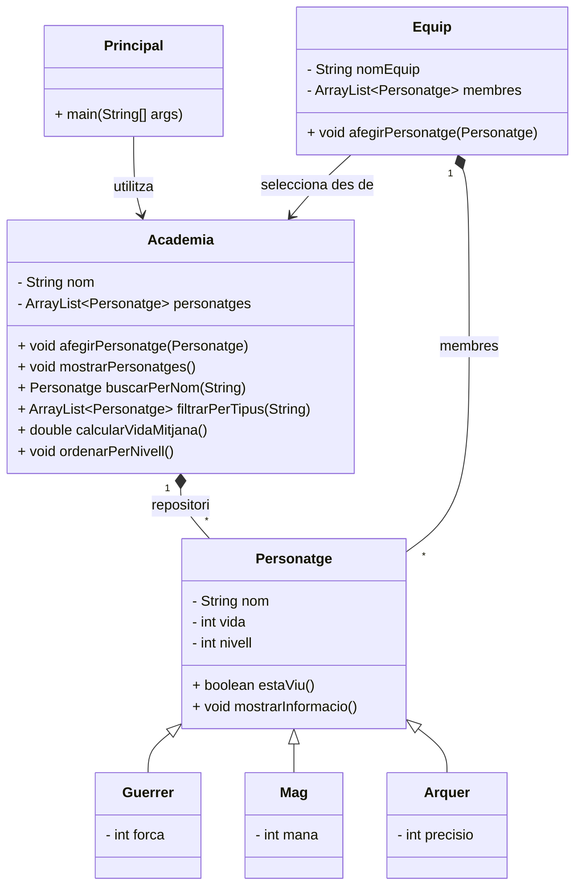

# Activitat: Ampliació d'un gestor de personatges (Java)

## Ampliació del projecte de personatges

Activitat pràctica guiada per ampliar el projecte anterior incorporant una `Academia` com a repositori de personatges.

---

## Contextualització

En aquesta activitat partireu del **projecte anterior**, on ja teniu implementats els personatges, les subclasses principals i la lògica bàsica de treball amb aquest domini. La novetat serà afegir una nova peça al sistema: una classe **Academia**.

La **Academia** actuarà com un **repositori de `Personatge`**: hi podreu desar tots els aventurers disponibles, consultar-los, filtrar-los, ordenar-los i preparar a partir d’aquí el vostre **Equip**. D’aquesta manera, l’`Equip` continua tenint sentit dins del projecte, però ara passa a dependre d’una estructura superior que centralitza la gestió dels personatges.

La vostra feina serà **entendre el codi existent** i **ampliar-lo** amb aquesta nova capa de funcionalitat. Això us permetrà practicar lectura de codi, manteniment, ampliació de projectes reals i treball amb col·leccions sense haver de reconstruir tota l’arquitectura des de zero.

---

## Objectius d’aprenentatge

Els objectius estan agrupats per competències perquè es vegi més clar què practicareu al llarg de l’activitat.

### Lectura de codi existent
Identificar quines classes hi ha, quines responsabilitats tenen i com es relacionen dins del projecte base.

### Ampliació de funcionalitats
Implementar una nova classe `Academia` i nous mètodes a partir d’uns requisits concrets sense trencar el comportament ja existent.

### Treball amb col·leccions
Recórrer, filtrar, cercar i ordenar estructures com `ArrayList<Personatge>` per resoldre problemes reals.

### Disseny orientat a objectes
Consolidar encapsulació, herència, interfícies i separació de responsabilitats en una aplicació ja estructurada.

---

## FASE 1 — Anàlisi del projecte base

Abans d’afegir funcionalitats, cal entendre bé què us proporciona ja el projecte anterior i què hi falta encara.

El projecte inclou classes com **Personatge**, les seves subclasses i la lògica necessària per treballar amb equips. Ara heu de dissenyar i implementar una nova classe anomenada **Academia**, que actuarà com a repositori general de personatges.

- **Ja implementat:** models principals, subclasses i projecte base anterior.
- **Pendent d’implementar:** la classe `Academia` i les funcionalitats de repositori sobre la col·lecció de personatges.

### Tasques d’anàlisi

1. Quines classes formen part del projecte i quina funció té cadascuna?
2. Quina diferència hi ha entre un `Equip` i una `Academia` dins del sistema?
3. Quines funcionalitats ja estan resoltes al projecte anterior i quines encara no?
4. Per què té sentit que l’`Academia` sigui el repositori de tots els personatges disponibles?

---

## FASE 2 — Disseny i implementació de l'Academia

En aquesta fase heu d’incorporar la nova peça principal de l’activitat: la classe `Academia`.

L’`Academia` representarà el repositori general de personatges disponibles per preparar equips o fer consultes globals sobre tots els aventurers registrats.

- **Atributs suggerits:** `nom` i `ArrayList<Personatge> personatges`.
- **Mètodes mínims:** constructor, `afegirPersonatge(...)` i `mostrarPersonatges()`.
- **Objectiu:** disposar d’una estructura central sobre la qual implementareu la resta de funcionalitats.

---

## FASE 3 i 4 — Cerques i filtres

Ara començareu a ampliar l’`Academia` amb funcionalitats útils sobre la col·lecció de personatges.

### Fase 3: Cerques

Implementeu mètodes que permetin localitzar personatges dins del sistema.

- **Propostes:** `buscarPerNom(String nom)`, `existeixPersonatge(String nom)`
- **Objectiu:** retornar un personatge concret o indicar si el sistema el conté.

### Fase 4: Filtres

Implementeu mètodes que retornin subconjunts de la col·lecció segons una condició.

- **Propostes:** `obtenirPersonatgesVius()`, `filtrarPerNivellMinim(int nivell)`, `filtrarPerTipus(String tipus)`
- **Objectiu:** practicar recorreguts, condicions i creació de noves llistes.

> **Ampliació opcional:** si voleu pujar una mica el nivell, podeu fer que algunes cerques no diferenciïn entre majúscules i minúscules.

---

## FASE 5 — Estadístiques del sistema

Aquesta fase se centra a obtenir informació global a partir del conjunt de personatges disponibles a l’`Academia`.

- **Propostes:** `calcularVidaMitjana()`, `obtenirPersonatgeMesNivell()`, `comptarPerTipus()`
- **Objectiu:** acumular valors, comparar elements i resumir la informació de la col·lecció.

---

## FASE 6 — Ordenació de personatges

Ara fareu que l’`Academia` pugui mostrar els personatges en diferents ordres segons el criteri que interessi.

- **Propostes:** ordenar per `nom`, per `nivell` o per `vida`.
- **Consell:** si voleu flexibilitat, podeu utilitzar `Comparator` per definir criteris d’ordenació diferents.
- **Exemple:** `personatges.sort(Comparator.comparing(Personatge::getNom));`

---

## FASE 7 — Funcionalitats extra sobre els personatges

Un cop funcionin les operacions de consulta, podeu incorporar accions que modifiquin l’estat del sistema dins de l’`Academia`.

Implementeu una o més funcionalitats d’aquest tipus:

1. `entrenarPersonatge(String nom)` per augmentar-li el nivell.
2. `curarTotsElsPersonatges(int quantitat)` per recuperar punts de vida.
3. `eliminarPersonatge(String nom)` per treure’l del repositori.

### Exemple de sortida esperada

```text
Personatge trobat: Lira (Arquer) - nivell 6
Personatges vius: 5
Vida mitjana del grup: 84.2

S'ha entrenat Thorin. Nou nivell: 8
Llistat de l'Academia ordenat per nivell:
Merlina - 9
Thorin - 8
Lira - 6
```

---

## FASE 8 — Programa principal i comprovacions

En aquesta fase heu de demostrar que les funcionalitats noves funcionen correctament amb dades de prova.

1. Carregueu diversos personatges de tipus diferents.
2. Executeu almenys una cerca i un filtre.
3. Mostreu una estadística general de l’`Academia`.
4. Proveu una ordenació.
5. Si voleu, creeu un `Equip` a partir de personatges seleccionats de l’`Academia`.

---

## FASE 9 — Preguntes de reflexió

Quan el programa funcioni, respon aquestes preguntes per justificar les decisions de disseny que has pres.

1. Quin avantatge té rebre un projecte base ja implementat en lloc de començar-lo completament des de zero?
2. Per què les operacions de cerca, filtre i ordenació tenen sentit dins la classe `Academia`?
3. Quina relació hi ha entre l’`Academia` i l’`Equip` dins d’aquest nou plantejament?
4. Quines parts del projecte anterior s’han pogut reutilitzar sense modificar-les?

---

## TEORIA — Teoria i tips útils

Aquest bloc us pot servir de suport quan arribeu a la part d’ordenació o quan vulgueu entendre millor algunes decisions de disseny.

### Què és una interfície?

Una **interfície** en Java és un contracte: defineix mètodes que una classe es compromet a implementar. No serveix per guardar estat com una classe normal, sinó per indicar _quin comportament ofereix_.

```java
public interface OrdenablePerNivell {
  void ordenarPerNivell();
}
```

Quan una classe implementa una interfície, ho indiquem amb la paraula clau `implements`.

```java
public class Academia implements OrdenablePerNivell {
  @Override
  public void ordenarPerNivell() {
    // implementacio del metode
  }
}
```

### `Comparable` i `Comparator`

`Comparable` s’utilitza quan una classe té un **ordre natural**. Per exemple, si decidim que els personatges s’han d’ordenar per nom de manera predeterminada.

```java
public class Personatge implements Comparable<Personatge> {
  @Override
  public int compareTo(Personatge altre) {
    return this.getNom().compareTo(altre.getNom());
  }
}
```

`Comparator`, en canvi, s’utilitza quan volem **diferents criteris d’ordenació** sense modificar la classe. És especialment útil en aquesta activitat, perquè l’`Academia` pot necessitar ordenar per nom, per nivell o per vida segons el cas.

```java
personatges.sort(Comparator.comparing(Personatge::getNom));

personatges.sort(
  Comparator.comparingInt(Personatge::getNivell).reversed()
);
```

Idea clau: si només voleu un criteri fix, `Comparable` pot tenir sentit. Si voleu flexibilitat i diversos criteris, normalment us interessarà més `Comparator`.

---

## EXTRA — Reptes i ampliacions

Si voleu anar més enllà, aquí teniu extensions per fer l’`Academia` més completa i més propera a un projecte real.

- **Evitar duplicats:** impedeix afegir dos personatges amb el mateix nom.
- **Nova subclasse:** incorpora un `Sanador` o una `Exploradora` i comprova si el sistema l’accepta sense grans canvis.
- **Resums per tipus:** genera estadístiques separades per Guerrers, Mags i Arquers.
- **Exportació textual:** crea un mètode que generi un resum complet del grup en format text.
- **Menú interactiu:** permet provar les funcionalitats amb un petit menú per consola.
- **Comparadors:** implementa diferents criteris d’ordenació reutilitzables amb `Comparator`.
- **Cerca parcial:** retorna personatges que continguin una part del nom.
- **Validacions:** controla casos com noms buits, nivells negatius o personatges inexistents.

### Pistes per a les ampliacions

- Per evitar duplicats, us pot anar bé reutilitzar el mètode de cerca abans d’afegir un nou element.
- Per a la nova subclasse, reviseu quines parts depenen realment del tipus concret i quines treballen amb `Personatge`.
- Per a les estadístiques, penseu si és millor retornar valors simples o construir un petit resum formatat.
- Per al menú interactiu, utilitzeu `Scanner` i separeu la lògica del menú de la lògica del model.
- Per a les ordenacions, penseu si us convé més `Comparable` o `Comparator` segons si voleu un únic ordre o diversos criteris.
- Per a les validacions, decidiu si preferiu ignorar l’operació o mostrar un missatge d’error clar per consola.
- Si voleu escalar el projecte, podeu crear una nova classe de suport com `ServeiAcademia`.

---

## UML — Diagrama del projecte base

A sota tens una representació simplificada del plantejament final: reutilitzeu el projecte anterior i hi afegiu una `Academia` com a repositori general de personatges per preparar equips.



Tip: el diagrama us pot ajudar a decidir on té sentit afegir cada funcionalitat nova.